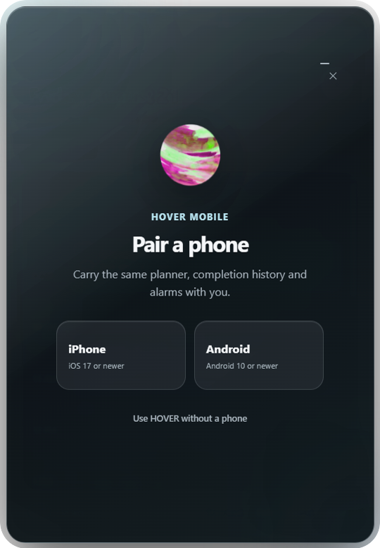
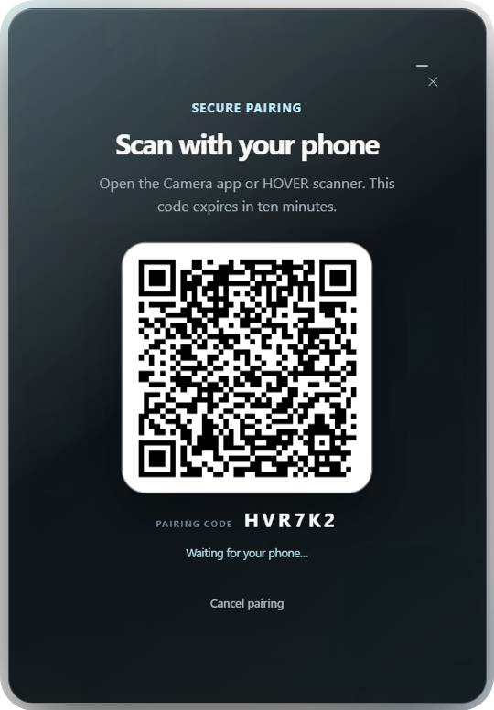

<p align="center">
  
</p>

<h1 align="center">HOVER</h1>

<p align="center">A small, always-on-top reminder calendar for Windows.</p>

<p align="center"><strong><a href="https://abdulla-qsqs.github.io/HOVER/">Visit the HOVER website</a></strong></p>

HOVER keeps the day within reach without taking over the desktop. Reminders appear as draggable calendar blocks in a transparent glass window, can alert you at the right time, and collapse into a compact Dynamic Island-style view.

## Download

**[Download HOVER for Windows](https://github.com/Abdulla-QsQs/HOVER/releases/latest/download/HOVER-Setup-1.2.1.exe)**

**[Install HOVER on your iPhone or Android Home Screen](https://hover-reminder.pages.dev/)**

- **iPhone or iPad:** open the link in Safari, tap **Share**, then **Add to Home Screen**.
- **Android:** open the link in Chrome, open the menu, then choose **Install app** or **Add to Home screen**.

The direct link downloads `HOVER-Setup-1.2.1.exe`. The guided installer can create Desktop and Start menu shortcuts. Release notes and checksums are available on the [Releases page](https://github.com/Abdulla-QsQs/HOVER/releases/latest).

> HOVER 1.2.1 is not code-signed. Windows SmartScreen may show an **Unknown publisher** notice; choose **More info → Run anyway** only when you downloaded it from this repository.

## Preview

<p align="center">
  
</p>

<p align="center">
  
  
</p>

## Mobile companion beta

The installable mobile PWA lives in [`mobile/`](mobile/README.md). It preserves the HOVER OLED-glass planner on iPhone and Android and includes the icon splash, secure desktop pairing and recovery, full day timeline, date navigation, add/edit sheet, completion removal, hold-to-drag interactions, and GitHub-style completion history.

The v1.2 backend adds standards-based Web Push subscriptions, timezone-aware alarm scheduling, encrypted iPhone/Android delivery, retries, deduplication, expired-device cleanup, and test notifications. Windows now starts with the user and remains in the tray after the window closes so local alarms continue running.

**[Install HOVER on your Home Screen](https://hover-reminder.pages.dev/)**

<p align="center">
  
</p>

## What it does

- Floats above other windows in a sticky-note-sized transparent glass panel.
- Places reminders as animated blocks on a day timeline.
- Moves a reminder by pressing and holding its block, then dragging it.
- Supports one-time and daily reminders with native Windows notifications.
- Marks reminders complete directly from the calendar or compact island.
- Switches dates with Back and Next while keeping the date heading accurate.
- Collapses into a Dynamic Island-style strip showing the next reminder.
- Creates or refreshes a Desktop shortcut from inside the app.
- Pairs with the mobile companion through an expiring QR code or manual code.
- Keeps reminder data local-first and optionally syncs it through the paired HOVER cloud profile.

## Quick start

1. Install and open HOVER.
2. Select **New reminder** or press `Ctrl+N`.
3. Add a title, date, time, repeat rule, color, and alarm.
4. Select **Add reminder**.
5. Use the circular control on a block to complete it, or press and hold the block to drag it to a new time.

For every control and behavior, see the [HOVER usage guide](docs/USAGE.md).

## Run from source

Requires Node.js 22.12 or newer.

```powershell
npm ci
npm start
```

## Build and verify

```powershell
npm test
npm run snapshots
npm run dist:win
```

The Windows installer is written to `dist/HOVER-Setup-1.2.1.exe`. Snapshot generation updates the images under `docs/screenshots/`.

## Release workflow

- `quality.yml` checks JavaScript and audits dependencies on pushes and pull requests to `main`.
- `windows-release.yml` builds the NSIS installer on Windows and attaches it to a GitHub release whenever a `v*` tag is pushed. It can also be run manually to verify the installer artifact.

```powershell
git tag v1.2.1
git push origin v1.2.1
```

## Privacy

HOVER has no analytics or advertising. Reminders are stored locally in Electron's application-data folder. Cloud storage is opt-in: it begins only after the user pairs a phone and chooses a username, and it uses revocable device tokens plus a recovery code instead of a password. Unpaired planners never upload reminder data.

## License

HOVER is available under the [MIT License](LICENSE).
